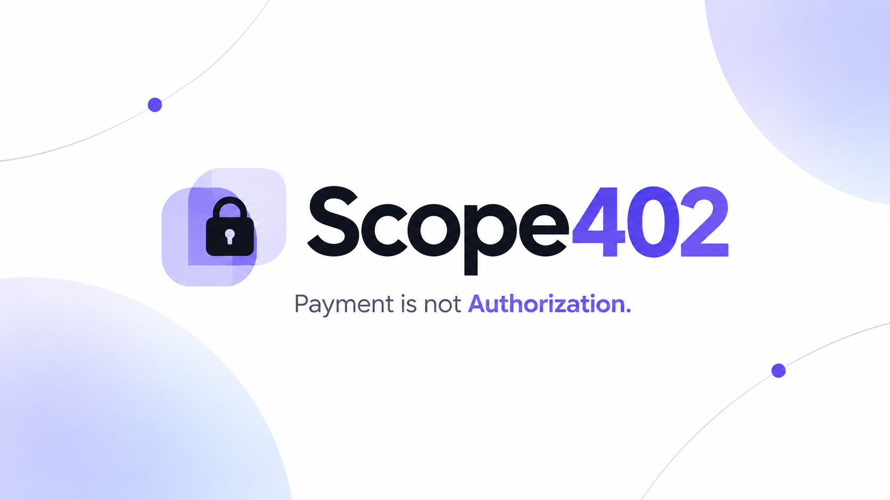
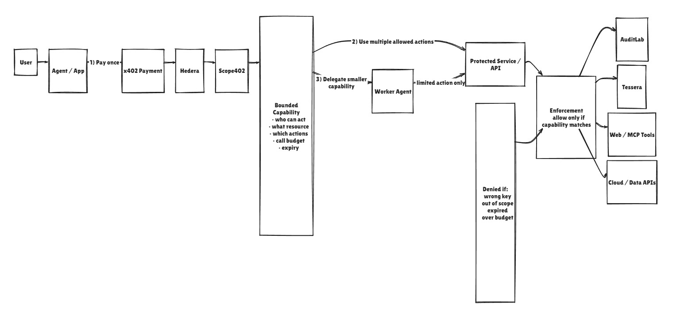
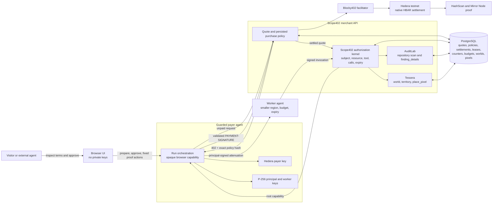

# Scope402

**Payment is not authorization.**



Scope402 is a payment-and-permission layer for AI agents. An agent can pay HBAR for useful work without
receiving unlimited access afterward. Each purchase defines who may act, what they may do, how many times,
and for how long; Scope402 represents that limited permission as a signed capability.

The reference merchant, AuditLab, scans a public GitHub repository and grants the declared agent three signed
calls to `finding_details` for five minutes.

Tessera is the visual proof. A principal purchases an `8 × 8` canvas capability, then delegates a strictly
smaller `4 × 4`, one-call capability to a different P-256 worker. The server accepts work inside the purchased
authority and rejects wrong-key, replayed, expired, and out-of-region actions.

## Live application

| Surface | URL | What it proves |
| --- | --- | --- |
| Scope402 | [scope402.onrender.com](https://scope402.onrender.com/) | Product explanation, live discovery, and system boundaries |
| AuditLab | [scope402.onrender.com/demo](https://scope402.onrender.com/demo/) | Real paid repository work followed by key-bound tool access and denial tests |
| Tessera | [scope402.onrender.com/tessera](https://scope402.onrender.com/tessera/) | Real paid canvas authority, narrower worker delegation, pixel placement, and denial tests |
| Merchant API | [health](https://scope402-auditlab.onrender.com/health) · [readiness](https://scope402-auditlab.onrender.com/ready) · [discovery](https://scope402-auditlab.onrender.com/.well-known/scope402) | Process status, payment-path dependencies, and machine-readable resources |
| Hosted payer agent | [health](https://scope402-demo-agent.onrender.com/health) | Whether the guarded testnet payer and browser orchestration service are available |

`/ready` checks PostgreSQL, Blocky402 Hedera testnet support, merchant configuration, and the P-256 capability
issuer. It returns `503` with sanitized per-dependency status when the payment-and-capability path is unavailable;
`/health` remains the process-liveness probe.

## What the interface shows

The browser is an inspection and control surface, not a wallet. A visitor can:

1. prepare a quote and inspect the price, Hedera accounts, resource, limits, and policy hash before payment;
2. explicitly approve one platform-funded Hedera **testnet** payment;
3. see the settled transaction and verify it on HashScan;
4. inspect the root capability's subject, resource, tools, call budget, expiry, and payment lineage;
5. delegate less authority to a different worker key;
6. place an allowed pixel and run fixed outside-region, wrong-key, replay, and expiry probes; and
7. refresh without paying twice while the hosted run still exists.

The current checkout includes an interactive Tessera world layer: visitors can choose or name a shared
`32 × 32` world, copy its URL, select one of sixteen `8 × 8` territories, choose a collaborative pixel mission,
paint with a server-approved palette, and inspect live territory status, contributors, and recent activity.
The browser receives changed server-authoritative world snapshots over a bounded SSE stream and automatically
falls back to slower polling if the stream is interrupted. This is not a WebSocket-scale real-time system or an
on-chain pixel-state claim.
Until this release is deployed, the public URL above remains the source of truth for what judges can use today.
The public-proof section separately identifies flows that completed real testnet settlement rather than treating
code or deployment as payment evidence.

### Interactions and evidence

The interfaces keep the important state transitions and server results visible instead of hiding them behind
an animation:

| Interaction | Visible evidence | What the server proves |
| --- | --- | --- |
| Prepare purchase | Price, payer, merchant, network, resource, policy hash | The agent knows the exact authority before signing |
| Pay | Hedera transaction and HashScan link | A distinct payer transferred the quoted native HBAR amount |
| Receive root capability | Subject, resource, tools, calls, expiry, lineage | Payment produced limited permission, not a general API key |
| Delegate to worker | Different P-256 subject and smaller region, budget, and lifetime | A principal can share less authority without sharing its wallet or root key |
| Perform allowed action | Finding response or committed pixel plus remaining calls | A valid signed invocation can use only purchased authority |
| Probe a boundary | Exact HTTP status and denial code in the action log | Wrong-key, replayed, expired, and out-of-scope requests fail without an unauthorized mutation |

These interactions represent practical patterns beyond the two demonstrations: paid developer tools, bounded
AI/API sessions, multi-agent task delegation, temporary cloud operations, and metered data or research access.
AuditLab and Tessera are the implemented proofs; the other examples are use cases, not integrations claimed today.

## Why

An x402 settlement proves that money moved. It does not decide what the buyer may do afterward. Scope402
connects the purchase to limited permission while keeping payment and authorization separate:



The diagram above shows the broader model. AuditLab and Tessera are implemented today; Web/MCP tools and
cloud/data APIs are examples of where the same authorization model can be applied, not current integrations.
The Mermaid diagram below describes the current checkout. It separates browser orchestration, real settlement,
capability enforcement, merchant work, and durable state instead of treating them as one trusted application.



The exported static runtime diagram is retained as a fallback and presentation asset:



The browser never receives the Hedera payer key, principal or worker private keys, raw leases, payment headers,
invocation signatures, or server control secrets. The payer is a separate Node.js process, and the merchant never
pays itself. Hedera proves that value moved; the persisted policy and Scope402 kernel define and enforce what the
purchase authorized. The capability policy is not claimed to be encoded in the Hedera transaction.

## Payment-to-permission flow

1. The agent requests work without payment.
2. The merchant persists the exact purchase policy and returns `402 Payment Required` with that policy.
3. The agent validates the merchant, network, amount, subject, resource, tools, call budget, expiry, and policy hash.
4. The agent signs only after those terms match its local policy.
5. Blocky402 verifies and settles native HBAR on Hedera testnet.
6. The merchant resumes useful work from the settled quote and issues one root capability with the same lineage.
7. Every later invocation is P-256 signed and atomically consumes its replay counter and call budget with the
   merchant mutation.
8. In Tessera, the principal may sign one strictly narrower child capability; the worker never receives the payer
   wallet or root private key.

## Use cases

Scope402 is useful when one payment should unlock several narrowly authorized follow-up actions instead of
charging for every call or exposing a broad bearer credential:

- **Paid developer tools:** purchase a repository scan, then use the resulting capability for finding details,
  report export, or remediation actions within its declared tool, call, resource, and time limits.
- **Browser and agent tools:** let an agent purchase a short working session for specific actions such as search,
  booking, submission, or editing without placing payment or capability keys in the browser.
- **AI APIs:** sell a bounded analysis package or temporary access to selected models and tools instead of an
  open-ended subscription or permanent API key.
- **Multi-agent workflows:** allow a principal agent to delegate a smaller resource scope, shorter lifetime, and
  conserved call budget to a worker without sharing the payment wallet or root private key.
- **Cloud and DevOps operations:** authorize narrowly scoped actions such as reading one environment's logs,
  restarting one service, or performing one deployment for a limited period.
- **Data and research access:** grant temporary access to specific datasets, query types, and usage budgets after
  payment while keeping later requests independently authorized.

## Implemented

- x402 v2 HTTP flow using `PAYMENT-REQUIRED`, `PAYMENT-SIGNATURE`, and `PAYMENT-RESPONSE`
- Blocky402 discovery, verification, and Hedera testnet settlement
- native HBAR payment with distinct payer and merchant accounts
- durable quote and transaction replay protection
- Mirror Node reconciliation when settlement was broadcast but the facilitator response is ambiguous
- resumable paid scan fulfillment without a second settlement
- public GitHub commit resolution and one bounded hygiene check
- compact ES256 ToolLease bound to the subject key declared before payment
- five-minute expiry and three-call budget
- RFC 8785/JCS argument hashing
- atomic counter and budget consumption in PostgreSQL
- explicit wrong-key, replay, expiry, and concurrent-counter tests
- responsive browser homepage backed by the live health and discovery endpoints
- guarded hosted testnet agent with prepare-before-pay approval, rate limits, spend ceiling, and balance floor
- browser demo for a real metered quote, explicit approval, settlement, scan result, ToolLease, allowed call,
  wrong-key denial, replay denial, and expiry denial
- x402 v2 `scope402` extension that binds the declared subject, exact resource revision, tool allowlist,
  call budget, and lease lifetime before the payer signs
- merchant-independent policy, lease, invocation, replay, expiry, budget, and resource-authorization kernel
- deployed Tessera `POST /v1/plots`, server-authoritative canvas, and atomic `place_pixel` execution
- parent-signed Tessera attenuation to a distinct worker key with strict rectangle containment, immutable
  payment lineage, separate delegation replay counters, and conserved parent/child budgets
- guarded Tessera browser orchestration with prepare-before-pay approval, refresh recovery, and fixed
  server-generated delegation and attack actions
- a persisted browser proof log that shows the quote, settlement, issued authority, delegation, allowed pixels,
  and every denial from hosted-agent state, with direct HashScan verification for settled runs
- player-selected Tessera pixels and palette colors signed by the guarded principal agent, with idempotent retries
  and server-enforced region and call-budget limits

### Interactive Tessera agent world

The public API exposes the world catalogue and server-authoritative state. The purchase, delegation, and
painting paths below are implemented and tested; the public-proof section separately identifies the exact
paid runs that were exercised on Hedera rather than treating deployment alone as payment evidence:

- multiple isolated `32 × 32` worlds with safe, shareable slugs and a bounded public-world limit
- abandoned unpaid empty worlds are reclaimed after quote expiry, so quote spam cannot permanently consume that limit
- a world catalogue and direct links such as `/tessera/?world=runtime-garden`
- explicit selection of one available `8 × 8` territory before quote creation
- transactionally unique reservations with `AVAILABLE`, `RESERVED`, `CLAIMED`, and `OPEN AGAIN` states
- local principal/worker canvas challenges whose targets remain inside the selected territory and count only
  pixels painted by the required principal or delegated worker in the challenge's required color
- server-authoritative contributor ranking, recent activity, painted-pixel totals, and distinct pixel-owner counts
- change-only server-sent world updates with a slower polling recovery path
- world-bound quotes, policies, root capabilities, delegated capabilities, invocations, and pixels
- synchronized discovery, OpenAPI, and agent quickstart coverage for named worlds and exact territory selection
- a local TypeScript reference SDK for typed world discovery, world-state reads, validated live world observation,
  prepare-before-pay purchases, exact policy validation, root painting, strict worker attenuation, serialized
  counters, and idempotent agent retries
- a read-only CLI that lets another process list or inspect public worlds without Hedera credentials
- a guarded autonomous-agent example that stops after showing the quote unless payment is explicitly enabled
- a deterministic Signal Spark mission planner that chooses open land, divides nine useful pixels between a
  principal and worker, calculates required and delegated calls, and identifies a natural worker boundary probe

No wallet connection, ENS identity, HCS audit trail, free-form browser signing, or on-chain pixel storage is
claimed. The canvas is stored in PostgreSQL; Hedera is the real payment rail.

## HTTP surfaces

| Method | Path | Purpose |
| --- | --- | --- |
| `GET` | `/health` | API process liveness |
| `GET` | `/ready` | Sanitized dependency readiness |
| `GET` | `/.well-known/scope402` | Scope402 resource and authority discovery |
| `POST` | `/v1/scans` | AuditLab x402 purchase and resumable scan fulfillment |
| `POST` | `/v1/plots` | Tessera x402 territory purchase and root-capability fulfillment |
| `GET` | `/v1/canvas` | Public server-authoritative default canvas |
| `GET` | `/v1/canvas/events` | Live default-world snapshots over server-sent events |
| `GET` | `/v1/canvas/:canvasId` | Public state for one implemented named world |
| `GET` | `/v1/canvas/:canvasId/events` | Live named-world snapshots over server-sent events |
| `GET` | `/v1/canvases` | Public implemented world catalogue |
| `POST` | `/v1/leases/:leaseId/delegations` | Principal-signed Tessera attenuation |
| `POST` | `/v1/tools/place_pixel` | Tessera capability-protected atomic pixel mutation |

The hosted agent exposes opaque `/demo/runs` and `/tessera/runs` orchestration routes for the browser. Independent
agents do not need that wrapper. The local `@scope402/agent` package exports a TypeScript SDK with the same explicit prepare, approve,
invoke, and delegate flow, while the OpenAPI and signing contract remain the language-neutral integration surface.
The SDK is a tested local package in this checkout and is not claimed as published on npm.

After building, any external agent or operator can inspect the deployed world without payment credentials:

```bash
node apps/agent/dist/cli.js worlds
node apps/agent/dist/cli.js world main
node apps/agent/dist/cli.js watch main
```

These commands validate the public response and emit machine-readable JSON; `watch` emits newline-delimited
live snapshots until interrupted. They never create a quote, reserve territory, or move HBAR.

SDK clients can also use `watchTesseraWorld(canvasId, signal)` to consume the public SSE feed. Every yielded
snapshot is schema-checked before agent use; payment configuration is still required only for purchases and
signed mutations.

The reference agent can also turn current world state into an inspectable plan before it requests a quote:

```ts
const world = await client.readTesseraWorld('main')
const plan = planTesseraMission(world)
// open territory, exact principal/worker pixels, required calls, and worker boundary probe
```

The autonomous example emits a machine-readable sequence from `WORLD_DISCOVERED` and `MISSION_PLANNED` through
`PAYMENT_APPROVAL_REQUIRED`. With explicit testnet payment approval, it continues through root issuance,
four-call worker delegation, an enforced `OUT_OF_SCOPE` boundary, nine useful pixel placements, and
`MISSION_COMPLETE`. This is deterministic orchestration around model- or human-supplied goals; no LLM is trusted
to construct signatures, bypass quote validation, or approve spending.

AuditLab exposes `finding_details`; Tessera exposes `place_pixel`. Both have public payment-to-denial proof,
with exact transactions and outcomes recorded below.

## Public proof

A public-origin run against `sindresorhus/is` completed payment, scanning, lease issuance, an authorized
follow-up, wrong-key denial, byte-identical replay denial, and server-side expiry denial.

- Transaction: `0.0.7162784@1788672696.168914659`
- [HashScan](https://hashscan.io/testnet/transaction/0.0.7162784-1788672696-168914659)
- Payer: `0.0.10374937`
- Merchant: `0.0.8258555`
- Amount: `55500` tinybars (`0.000555 HBAR`)
- Scanned commit: `7821031c66cdeb7256a0feb2d506535f9e84fcaf`
- Lease audience: `https://scope402-auditlab.onrender.com/v1/tools`

The Hedera Mirror Node reports `SUCCESS` and the corresponding 55,500 tinybar payer debit and merchant
credit. The public hosted-agent path returned `200 FINDING_DETAILS_ALLOWED`, `403 SUBJECT_KEY_MISMATCH`,
`403 REPLAY_DETECTED`, and `410 LEASE_EXPIRED`.

A public Tessera run purchased an `8 × 8`, 12-call root capability, delegated a contained `4 × 4`, one-call
capability to a different P-256 worker, committed one in-scope pixel, and rejected boundary violations.

- Transaction: `0.0.7162784@1788672630.715449934`
- [HashScan](https://hashscan.io/testnet/transaction/0.0.7162784-1788672630-715449934)
- Payer: `0.0.10374937`
- Merchant: `0.0.8258555`
- Amount: `56000` tinybars (`0.00056 HBAR`)
- Root policy hash: `sha256:6296a9fb395ad12c956f9dc3556588e62b0985d6bf629ea9dea82ec90d702a24`

Mirror Node reports `SUCCESS` / `CRYPTOTRANSFER`, the 56,000-tinybar payer debit, and matching merchant
credit. The hosted path returned `200 CAPABILITY_DELEGATED`, `403 OUT_OF_SCOPE`,
`403 SUBJECT_KEY_MISMATCH`, `200 PIXEL_PLACED`, `403 REPLAY_DETECTED`, and `410 LEASE_EXPIRED`.

## Run locally

For independent agents, start with the [TypeScript SDK](apps/agent/README.md),
[quickstart](apps/web/public/docs/agent-quickstart.md),
[HTTP and signing contract](apps/web/public/docs/api-contract.md), and
[Tessera OpenAPI](apps/web/public/openapi.json). The website publishes a small
[llms.txt documentation index](apps/web/public/llms.txt); this does not imply a directory listing or automatic client compatibility.

Requirements: Node.js 22+, pnpm through Corepack, and PostgreSQL.

```bash
corepack pnpm install --frozen-lockfile
cp apps/api/.env.example apps/api/.env
corepack pnpm build
corepack pnpm start
```

API environment:

```text
DATABASE_URL=
HEDERA_MERCHANT_ACCOUNT_ID=
SCAN_BASE_PRICE_TINYBARS=50000
SCAN_PER_FILE_TINYBARS=500
SCAN_FILE_CAP=100
AUDITLAB_URL=http://127.0.0.1:3000
TOOL_LEASE_PRIVATE_KEY_PATH=/absolute/path/to/p256-private-key.pem
GITHUB_TOKEN=
```

Generate the merchant's lease-signing key outside the repository:

```bash
openssl genpkey -algorithm EC -pkeyopt ec_paramgen_curve:P-256 -out ~/.config/scope402/lease-signing.pem
chmod 600 ~/.config/scope402/lease-signing.pem
```

The agent additionally requires its own funded Hedera testnet payer account and private key. Keep those values in an environment file outside the repository:

```text
AUDITLAB_URL=http://127.0.0.1:3000
HEDERA_PAYER_ACCOUNT_ID=
HEDERA_PAYER_PRIVATE_KEY=
HEDERA_MERCHANT_ACCOUNT_ID=
MAX_PAYMENT_TINYBARS=150000
```

Run the paid client:

```bash
node --env-file=/path/to/agent.env apps/agent/dist/index.js https://github.com/expressjs/express
```

Run the autonomous Tessera example in quote-only mode after building:

```bash
node --env-file=/path/to/agent.env apps/agent/examples/autonomous-tessera-agent.mjs
```

It validates and prints the exact price, merchant, territory, and policy hash, then exits without moving HBAR.
Only setting `SCOPE402_APPROVE_PAYMENT=yes` makes it approve the transaction, delegate a narrower worker
capability, enforce one natural worker boundary, and complete the nine-pixel principal/worker mission. The example emits structured `WORLD_DISCOVERED`,
`MISSION_PLANNED`, `PAYMENT_APPROVAL_REQUIRED`, `CAPABILITY_DELEGATED`, `BOUNDARY_ENFORCED`, principal/worker
pixel events, and `MISSION_COMPLETE` so an agent log makes
the complete infrastructure path auditable. Use that switch only with your own funded testnet payer and reviewed terms.

Run the browser app locally:

```bash
corepack pnpm --filter @scope402/web dev
```

Then open:

- homepage: `http://127.0.0.1:5173/`
- AuditLab: `http://127.0.0.1:5173/demo/`
- Tessera: `http://127.0.0.1:5173/tessera/`
- a named local world: `http://127.0.0.1:5173/tessera/?world=runtime-garden`

The default Vite development proxy targets the public merchant API and hosted agent. To exercise an entirely
local payment path, run the API and guarded agent with their own external environment files and set the web
app's `VITE_AUDITLAB_URL`, `VITE_DEMO_AGENT_URL`, `VITE_TESSERA_API_URL`, and `VITE_TESSERA_AGENT_URL`
accordingly (for example, `VITE_TESSERA_AGENT_URL=http://127.0.0.1:3001`). Never put funded account keys in
the web app or a committed environment file. The proxy keeps the public hosted agent as the default when these
variables are absent.

## Verify

```bash
corepack pnpm typecheck
corepack pnpm test
corepack pnpm build
```

`pnpm test` includes PostgreSQL integration tests. It verifies AuditLab payment recovery and ToolLease
enforcement plus Tessera slot reservation, atomic pixel mutation, resource denial, parent-signed delegation,
immutable lineage, root expiry, budget conservation, and concurrent invocation/delegation races.

## Current boundaries

- Hedera **testnet**, not mainnet
- public GitHub repositories only
- one deterministic repository check and one follow-up tool
- quotes bind an exact GitHub commit and meter bounded root-file workload
- API and browser app are public; `/demo` can request a quote and ask a dedicated hosted testnet agent to purchase it
- the hosted demo payer is separate from the merchant and policy-limited; the browser never receives payment or capability keys
- completed paid retries return the original scan and ToolLease instead of granting fresh authority
- browser proof actions are fixed requests, while Tessera painting accepts only a pixel, palette color, and opaque
  request ID; keys, lease tokens, signatures, counters, payment fields, and demo-control secrets remain outside the browser
- hosted-agent run and abuse-control state is intentionally single-instance and in memory for this public testnet
  demonstration; a hosted-agent restart clears browser-run recovery and rate-limit state, and multiple agent instances
  would not share those controls. Durable merchant state—including quotes, settlements, leases, replay counters, budgets,
  and Tessera pixels—remains in PostgreSQL. The hosted agent is not presented as a production multi-instance control plane
- no HCS anchoring, Agent Kit plugin, or additional sponsor integration yet
- Tessera's paid-root, atomic pixel, one-level delegation, hosted-agent orchestration, browser UI, and public
  Hedera payment-to-denial sequence are implemented and evidenced; no ENS or WebMCP proof is claimed

## AI assistance

AI tools assisted with research, implementation, testing, and review under human direction. They are not a
runtime dependency or a source of evidence. Every claimed payment, deployment, scan, and authorization result
above was exercised against the named live or testnet boundary; local tests are described separately from
public proof. See the concise [AI-assisted development disclosure](docs/ai/README.md).
